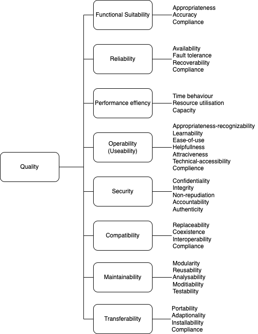

[[section-quality-scenarios]]
== Quality Requirements

During the build process, the following quality checks should already be checked and if one is not correct, then the entire build process should fail.

=== Quality Tree

=== Quality Scenarios

Tools during build process:

* run all Tests (do not skip Tests)
** run gradle without the option `-x test` !
* Tests have a test coverage of 80% (business logic, no pojo)
** Tool: Jacoco
* static Codeanalysis
** Tools: PMD, Spotbugs
* check security of the software
** Tool: OWASP

Additionally, watch the console.